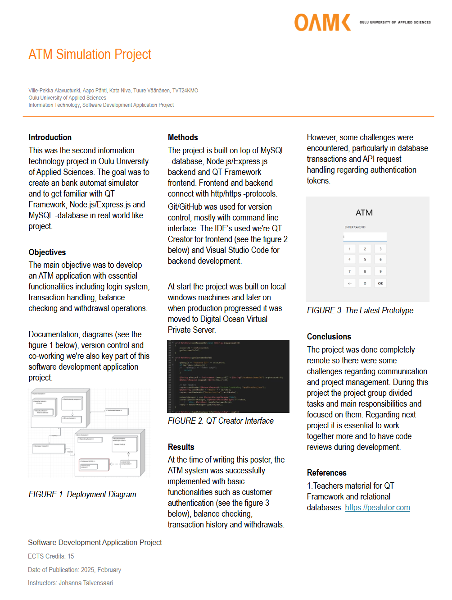

# ATM Simulator Project
This was the second information technology project in Oulu University of Applied Sciences. The goal was to create an ATM simulator and to get familiar with QT Framework, node.js/express.js and MySQL -database in real world like project. Documentation and diagrams we're also key part of this software development application project.

## How the App Works
At the start application prompts for cardId. After the ID is succesfully entered PIN-code input prompt appears and user needs to type 4 number PIN within 10 second time limit. If user types wrong PIN-code three times in a row card is locked and needs to be reactivated by the sysadmin.

User has an possibility to hold both credit and debit cards as well as combination of them. If number for combination card is entered the app prompts which one user likes to select.

In main menu there are shortcuts for withdraw money, show balance, show transactions and logout.

Below is the state diagram for the project which demonstrates basic functionality of the application.

### State Diagram

## Technologies
This project is build on top of following technologies:
- Frontend: QT-framework / C++
- Backend: REST API; Node.js/Express.js
- Database: MySQL database

## System Requirements
The system includes the following components:

- The actual computer of the target system, which has an Windows operating system.

- A server computer that runs the latest Windows or Linux operating system. The server runs the MySQL database selected for the product.

- A computer network for data transmission (using http or https protocol) between the ATM's computer and the server.

- The product uses a REST API node.js/express.js in between the ATM application and the database.

### ER-Diagram for the Database

### Project Poster

## License
This software and it's documentation is using MIT license.

## Developers and Their Main Responsibilities
- [Ville-Pekka Alavuotunki](https://github.com/alavuvi) - login system (front- and backend), combination card, timers, cruds for card/accountcard, various backend models and routes etc..
- [Aapo Pähti](https://github.com/PahtiA) - account cruds and balance in QT
- [Kata Niva](https://github.com/kataniva) - transactions cruds and transactions in QT
- [Tuure Väänänen](https://github.com/tvll) - customer cruds and withdraw in QT

Together we transitioned our backend to Digital Oceans Linux Virtual Servers and set it up with automatic database backup solutions built with bash script and crontab job.