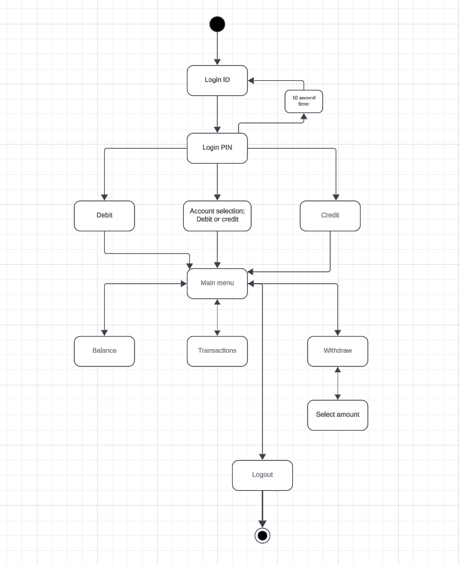

# Bankautomat simulator project (group 11)
This was our second information technology project in Oulu University of Applied Sciences. The goal was to create an bank automat -simulator.

## How the app works
At the start application prompts for cardnumber. After number is succesfully entered PIN-code input prompt appears and user needs to type 4 number PIN within 10 second time limit.

User has a possibility to hold both credit and debit cards as well as combination of them. If number for combination card is entered app prompts which one user likes to use.

In main menu there are shortcuts for withdraw money, show balance, show transactions and logout.

Below is the state diagram for project which demonstrates basic functionality of the application.

### State diagram

## Technologies
This project is build on top of following technologies:
- Frontend: QT-framework / C++
- Backend: REST API, Node.js/Express.js
- Database: MySQL database made from scratch

## System requirements
The system includes the following system components:

- The actual computer of the target system (i.e., the ATM), which has an operating system and security software.

- A server computer that runs the latest Windows or Linux operating system and a security software package. The server runs the database solution selected for the product.

- A computer network for data transmission (using http or https protocol) between the ATM's computer and the server.

- The product uses a REST (Representational State Transfer) interface solution between the ATM application and the database.

- Virtual cards, which are the system's bank cards.

### ER-Diagram for the database

## License
Coming later...

## Made by following students:
- Ville-Pekka Alavuotunki
- Aapo Pähti
- Kata Niva
- Tuure Väänänen